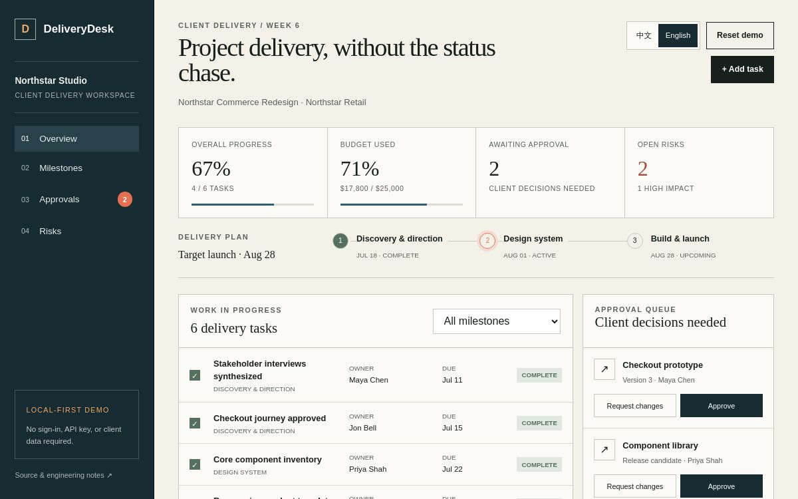

# DeliveryDesk

DeliveryDesk is an interactive client delivery and approval portal built as a production-minded portfolio case study. It replaces scattered status updates with one workspace for milestones, tasks, budget health, risks, approvals, and recent decisions.

**Live demo:** [deliverydesk-portal.hugs-poise-9.chatgpt.site](https://deliverydesk-portal.hugs-poise-9.chatgpt.site)



## What clients can try

- Complete or reopen delivery tasks and watch progress update
- Filter work by milestone
- Approve deliverables or request changes
- Add a task with an owner and milestone
- Review budget use, delivery risks, and recent activity
- Export a structured project report
- Switch between English and Chinese
- Reset the local demo at any time

The public demo uses fictional project data and browser storage. It requires no account, API key, or real client information.

## Engineering quality

- Typed project model and deterministic state transitions
- Responsive layouts for desktop, tablet, and mobile
- Keyboard-accessible native controls and focus handling
- Local persistence with an explicit reset path
- Unit and server-rendered integration tests
- Lint, type, build, and production dependency audit gates

## Local development

```bash
npm install
npm run dev
```

Run the complete quality gate with `npm run check`.

